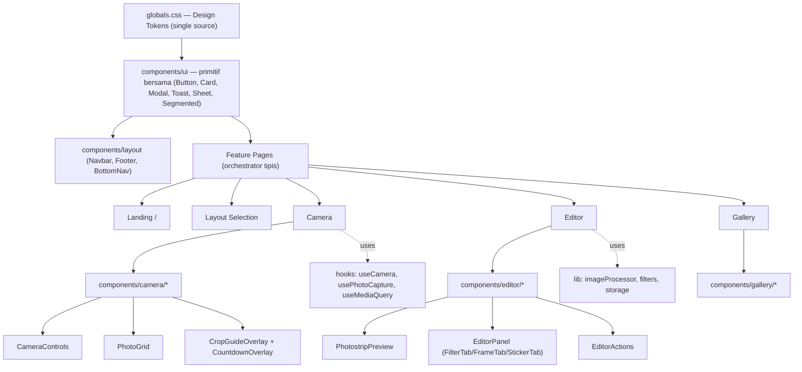

## Overview

Tujuan: membuat UX Pojok Foto lebih nyaman di **mobile & desktop** sambil mempertahankan identitas **Neobrutalist** dan tetap menjaga skor performa yang sudah 100. Pendekatannya **evolve, bukan overhaul** — sistem desain dirapikan, halaman-halaman interaktif (Camera & Editor) yang paling kompleks dibenahi, lalu lapisan responsif + aksesibilitas + performa dipoles.

<aside>
🔎

**Hasil analisis repo** (`jmahiswara1/pojok-foto`): Next.js 16 App Router + React 19 + Tailwind v4 + Shadcn UI + lucide-react (React Compiler aktif), backend Express + Prisma + PostgreSQL. Frontend tersusun di `frontend/src/app` (home, camera, editor, gallery, layout-selection, profile, auth) dengan `components/{layout,shared,ui}`, `hooks`, `constants`, dan `lib`.

</aside>

Temuan utama yang jadi dasar plan ini:

- **Dua sistem desain yang bertabrakan** — class custom `.brutal-*` di `globals.css` (radius 0, hard shadow) hidup berdampingan dengan token Shadcn (`--radius: 0.625rem`, sudut membulat). Perlu satu sumber kebenaran.
- **`camera/page.tsx` (≈27KB) & `editor/page.tsx` (≈32KB) monolitik** — semua state, logika, dan markup dalam satu file `use client`. Logika *crop guide* di Camera tidak melacak aspect ratio video di state (banyak komentar “React mungkin tidak re-render…”), sehingga overlay kurang andal.
- **Feedback pakai `alert()`** untuk save/download/error, tab **Sticker masih “Coming Soon”**, dan ada blok `setFrameOverlay` yang **terduplikasi** di Editor.
- **Mobile**: kontrol kamera & panel editor sempit, belum ada *safe-area* (notch), target sentuh < 44px di beberapa tombol.
- **Aksesibilitas (skor 96)**: teks sekunder `#B8B8B8` di atas putih gagal kontras WCAG, dropdown custom tanpa atribut ARIA, Navbar render fragment kosong saat belum `mounted` (potensi layout shift).

Plan ini disusun sebagai **blueprint eksekusi untuk Antigravity** — tiap langkah berisi file target dan perubahan konkret, sehingga bisa langsung dikerjakan oleh coding agent.

<aside>
🧩

**Prinsip reusable component** (sesuai permintaan): tiap halaman kompleks punya folder komponen sendiri — `components/editor/`, `components/camera/`, `components/gallery/`, `components/layout-selection/` — untuk komponen spesifik fitur, sementara primitif lintas-fitur (Button, Card, Modal, Toast, Sheet) tetap di `components/ui/`. `page.tsx` hanya jadi *orchestrator* tipis yang merangkai komponen + state.

</aside>

## Your Preferences

Karena survei dilewati, plan memakai default yang masuk akal berdasarkan analisis repo:

- **Arah desain:** Evolve — pertahankan Neobrutalist (border tebal, hard shadow, high contrast), modernkan kerapian & konsistensi.
- **Fokus:** UX mobile **dan** desktop, terutama flow Camera → Editor → Gallery.
- **Arsitektur komponen:** **reusable & modular** — komponen spesifik fitur di `components/<fitur>/` (mis. `components/editor/`), primitif bersama di `components/ui/`, `page.tsx` hanya orchestrator.
- **Performa:** jangan turunkan skor Lighthouse yang sudah 100; targetkan Accessibility 96 → 100.
- **Eksekusi:** kode dikerjakan di **Antigravity**; dokumen ini adalah spesifikasi, bukan perubahan kode langsung.
- **Scope:** frontend (`frontend/`). Backend hanya disentuh bila perlu (mis. endpoint sticker).

> Jika ada preferensi berbeda (mis. ingin overhaul total, ganti palet warna, atau tambah dark mode), beri tahu dan plan akan disesuaikan.
> 

## Implementation Plan

### Step 1: Tetapkan Arsitektur Komponen Reusable

Tetapkan konvensi folder agar kode modular & reusable — ini jadi fondasi langkah-langkah berikutnya.

**Struktur target di `frontend/src/components/`:**

```
components/
  ui/            # primitif lintas-fitur: Button, Card, Modal, Toast, Sheet, Segmented, Dropdown
  layout/        # Navbar, Footer, BottomNav
  camera/        # CameraControls, PhotoGrid, CropGuideOverlay, CountdownOverlay, CaptureModeToggle
  editor/        # PhotostripPreview, EditorPanel, FilterTab, FrameTab, StickerTab, EditorActions
  gallery/       # GalleryGrid, AlbumCard, EmptyState
  layout-selection/  # LayoutCarousel, LayoutPreview
  shared/        # ImageCropper, LoadingScreen, LoadingSpinner (sudah ada)
```

**Aturan:**

- [x]  Komponen **spesifik fitur** → `components/<fitur>/` (contoh: `components/editor/...`).
- [x]  Komponen **dipakai ≥ 2 fitur** → `components/ui/` atau `components/shared/`.
- [ ]  `app/<fitur>/page.tsx` jadi **orchestrator tipis** — hanya state + merangkai komponen, bukan markup raksasa.
- [x]  Tiap folder punya `index.ts` barrel export agar import rapi.
- [ ]  Props bertipe jelas (TypeScript), hindari `any`.

<aside>
🧩

Hasil: file `page.tsx` Camera (≈27KB) & Editor (≈32KB) menyusut drastis karena logikanya pindah ke komponen reusable.

</aside>

### Step 2: Konsolidasi Design System & Token

Satukan sumber kebenaran styling agar Neobrutalist konsisten dan menghapus konflik dengan Shadcn.

- [x]  Di `frontend/src/app/globals.css`: jadikan token brutal (`--border-width`, `--shadow-brutal*`, palet) sebagai sumber utama; **set `--radius: 0`** (atau radius kecil yang disengaja) agar Shadcn tidak memunculkan sudut membulat yang melawan estetika.
- [x]  Tambah skala **typography & spacing** yang konsisten (clamp untuk heading sudah ada — rapikan jadi token).
- [x]  **Perbaiki kontras**: ganti teks sekunder `#B8B8B8` → warna yang lolos WCAG AA (mis. `#595959`/`#4D4D4D`) untuk body & label.
- [x]  Audit komponen Shadcn (`ui/*.tsx`) agar memakai border/shadow brutal, bukan style default rounded.

<aside>
🎯

Target: satu bahasa visual, kontras lolos AA, nol konflik radius.

</aside>

### Step 3: Rapikan Komponen Inti & Sistem Feedback

Standardisasi primitif `components/ui/` yang dipakai lintas halaman + ganti `alert()` dengan feedback yang proper.

- [x] **Toast/Notification brutal** baru (`components/ui/Toast.tsx`) untuk menggantikan semua `alert('...')` di Editor (save/download/error) dan tempat lain.
- [x] **Navbar** (`components/layout/Navbar.tsx`): ganti `return <fragment kosong/>` saat `!mounted` dengan **skeleton navbar statis** agar tidak ada layout shift / flash; ganti `window.location.href` logout dengan navigasi router + state.
- [x] Pastikan `Button`, `Card`, `Modal` punya varian konsisten (white/black/ash) + state hover/active brutal — jadikan benar-benar reusable.
- [x] Tambah komponen **Bottom Sheet / Drawer** (`components/ui/Sheet.tsx`) untuk dipakai panel kontrol mobile di Camera & Editor.

### Step 4: Revamp Halaman Camera (mobile-first + komponen)

`camera/page.tsx` adalah titik pain terbesar — pecah jadi `components/camera/*` & andalkan state yang benar.

**Refactor struktur (reusable):**

- [x]  Pecah ke `components/camera/`: `CameraControls`, `PhotoGrid`, `CropGuideOverlay`, `CountdownOverlay`, `CaptureModeToggle`.
- [x]  `page.tsx` tinggal mengatur state kamera + merangkai komponen.
- [x]  **Lacak aspect ratio video di state** (`videoAR`) dari event `onLoadedMetadata` agar crop guide akurat — hapus komentar/heuristik “React mungkin tidak re-render”.

**UX mobile:**

- [x]  Jadikan layout **full-screen camera** dengan kontrol di bawah memakai `env(safe-area-inset-bottom)` (aman untuk notch).
- [x]  Tombol shutter & kontrol minimal **44×44px**; thumbnail hasil sebagai strip horizontal yang bisa di-scroll, bukan disembunyikan.
- [x]  **Delay dropdown** custom → komponen aksesibel (atau segmented control) dengan ARIA.

**Desktop:** rapikan grid kiri-kanan (preview besar + progress grid) dengan spacing konsisten.

### Step 5: Revamp Halaman Editor (komponen + panel adaptif)

`editor/page.tsx` perlu dipecah ke `components/editor/*`, dibersihkan dari bug, dan dibuat nyaman di mobile.

**Komponenisasi (reusable):**
- [x]  Pecah ke `components/editor/`: `PhotostripPreview`, `EditorPanel`, `FilterTab`, `FrameTab`, `StickerTab`, `EditorActions`.

**Bug & dead code:**

- [x]  Hapus blok **`setFrameOverlay(p.frameAsset)` yang terduplikasi**.
- [ ]  Rekonsiliasi `constants/{filters,frames,stickers}.ts` vs asset dari DB — pilih satu sumber (DB) atau jadikan constants sebagai fallback yang jelas.

**Fitur:**

- [x]  Implementasikan tab **Sticker** memakai `stickerAssets` yang sudah di-fetch — bisa drag untuk menempel, dan hapus per sticker.

**UX:**

- [x]  Desktop: preview kiri + panel kanan (rapikan spacing & color picker `react-colorful`).
- [x]  Mobile: preview di atas, **panel kontrol jadi bottom sheet** (`components/ui/Sheet.tsx`) dengan tab Filter/Frame/Sticker; tombol Retake/Save/Download sticky.
- [x]  Ganti `alert()` save/download → Toast (langkah 3).
- Catatan teknis download
    
    `handleDownload` pakai `html-to-image` `toPng` pixelRatio 2 — pertahankan, tapi tambahkan state loading & error yang konsisten lewat Toast.
    

### Step 6: Poles Landing, Layout-Selection & Gallery

Halaman pendukung disamakan ritmenya dengan sistem desain baru + dipecah ke komponen reusable.

- [x]  **Landing (`page.tsx`)**: pertahankan hero & marquee, rapikan grid kartu tools agar responsif (1 kolom mobile → 3 kolom desktop) dengan gap konsisten.
- [x]  **Layout-Selection**: pecah ke `components/layout-selection/` (`LayoutCarousel`, `LayoutPreview`); perbesar target sentuh tombol prev/next di mobile, perjelas indikator “Layout X of N”, rapikan dua tombol aksi (Use Camera / Use Editor).
- [x]  **Gallery (`gallery/page.tsx`)**: pecah ke `components/gallery/` (`GalleryGrid`, `AlbumCard`, `EmptyState`); grid album responsif, empty-state brutal yang jelas, loading skeleton (bukan spinner kosong).
- [x]  Optimalkan `public/preview-porto.png` (≈580KB) → kompres / `next/image`.

### Step 7: Lapisan Mobile UX & Navigasi

Konsistenkan perilaku responsif di seluruh app.

- [ ]  Standardisasi breakpoint (manfaatkan `hooks/useMediaQuery.ts`) — hentikan campuran `@media 768px` custom + util Tailwind.
- [ ]  Terapkan **safe-area insets** global (notch / home indicator) untuk header & footer sticky.
- [ ]  Pastikan semua target sentuh **≥ 44px** dan ada `:active` feedback brutal (push effect).
- [ ]  Pertimbangkan **bottom navigation bar** di mobile (`components/layout/BottomNav.tsx`: Home/Camera/Gallery/Profile) sesuai footer nav yang sudah ada di desain.
- [ ]  Cegah horizontal scroll (audit elemen yang memicu `overflow-x`).

### Step 8: Optimasi Performa (jaga skor 100)

Skor Lighthouse sudah 100/96/100/100 — fokus menjaga & mengoptimalkan real-world UX tanpa regresi.

- [ ]  **Code-splitting**: pecah komponen berat (color picker, sticker panel, cropper `react-easy-crop`) dengan `next/dynamic` agar tidak masuk bundle awal Editor — lebih mudah setelah komponenisasi langkah 5.
- [ ]  Kurangi luas `'use client'` — jadikan bagian statis (hero, footer) **server component**; sisakan island interaktif saja.
- [ ]  Audit ukuran bundle per route setelah Camera/Editor dipecah (langkah 4 & 5).
- [ ]  Optimasi aset gambar (`next/image`, ukuran logo, kompres preview).
- [ ]  Verifikasi `next.config.ts` & `vercel.json` (caching headers) tetap optimal.

<aside>
⚡

Prinsip: tidak menurunkan Performance/Best Practices/SEO yang sudah 100; ukur ulang setelah tiap perubahan besar.

</aside>

### Step 9: Aksesibilitas & QA Akhir

Dorong Accessibility 96 → 100 dan validasi lintas device.

- [ ]  Tambah `aria-label`, `role`, dan focus-visible state pada dropdown/tab/tombol custom.
- [ ]  Pastikan semua kontras teks lolos **WCAG AA** (lanjutan langkah 2).
- [ ]  Navigasi keyboard penuh di flow Camera → Editor → Gallery.
- [ ]  Uji di viewport: **mobile (375px), tablet (768px), desktop (1280px+)** + uji notch (safe-area).
- [ ]  Re-run Lighthouse (semua kategori) + cek tidak ada regresi.

**Checklist rilis:**

- [ ]  Struktur `components/<fitur>/` rapi & ada barrel export
- [ ]  Semua `alert()` tergantikan Toast
- [ ]  Tab Sticker berfungsi
- [ ]  Crop guide Camera akurat
- [ ]  Tidak ada horizontal scroll di mobile
- [ ]  Accessibility = 100

## Architecture

